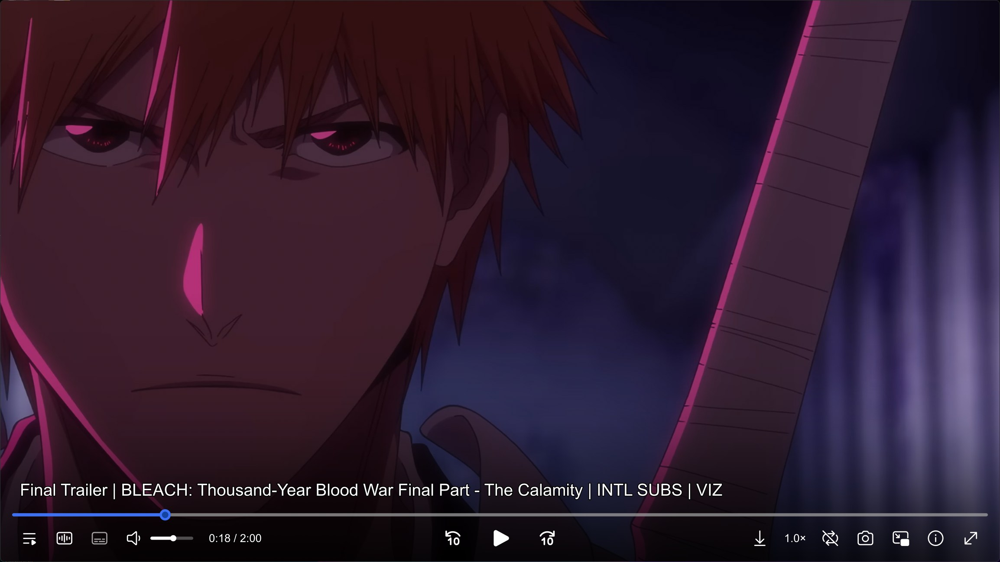

# Personal MPV Configs



**Alternative OSC for mpv**
- [ModernZ](https://github.com/Samillion/ModernZ)

**Scripts & Add-ons**
- [yt-dlp](https://github.com/yt-dlp/yt-dlp)
- [sponsorblock_minimal](https://codeberg.org/jouni/mpv_sponsorblock_minimal)
- [celebi](https://github.com/po5/celebi)
- [thumbfast](https://github.com/po5/thumbfast)
- [MPV-Single-Instance](https://github.com/ashik4u/MPV-Single-Instance)

**Configs**
- [MPV](https://mpv.io/)

    ```
    osc=no
    osd-bar=no
    title-bar=no
    vo=gpu-next
    hwdec=auto
    gpu-api=d3d11
    d3d11-flip=yes
    d3d11-exclusive-fs=no
    save-position-on-quit=yes
    auto-window-resize=no
    geometry=1920x1080
    keep-open=yes
    audio-normalize-downmix=no
    gpu-shader-cache=yes

    slang=en
    sub-ass-override=force
    sub-font="Trebuchet MS Bold"
    sub-border-size=2
    sub-shadow-offset=2.5
    sub-bold=yes 

    framedrop=no
    hr-seek-framedrop=no

    watch-later-options-remove=sub-pos
    watch-later-options-remove=osd-margin-y

    screenshot-format=jpg
    screenshot-jpeg-quality=100

    ytdl-format=bestvideo[height<=1440]+bestaudio/best[height<=1440]
    ytdl-raw-options=format-sort=codec:av01
    ```

- [ModernZ](https://github.com/Samillion/ModernZ)

    ```
    windowcontrols_close_hover=#3C71F7
    windowcontrols_max_hover=#3C71F7
    windowcontrols_min_hover=#3C71F7
    seekbarfg_color=#3C71F7
    seek_handle_color=#1343A0
    seek_handle_border_color=#3C71F7
    hover_effect_color=#3C71F7
    nibble_color=#3C71F7
    ```

- [celebi](https://github.com/po5/celebi)

    ```
    volume=yes
    sub-pos=yes
    ```

- [thumbfast](https://github.com/po5/thumbfast)

    ```
    spawn_first=yes
    ```

- [MPV-Single-Instance](https://github.com/ashik4u/MPV-Single-Instance)

    ```
    default_play_mode=replace
    ```
